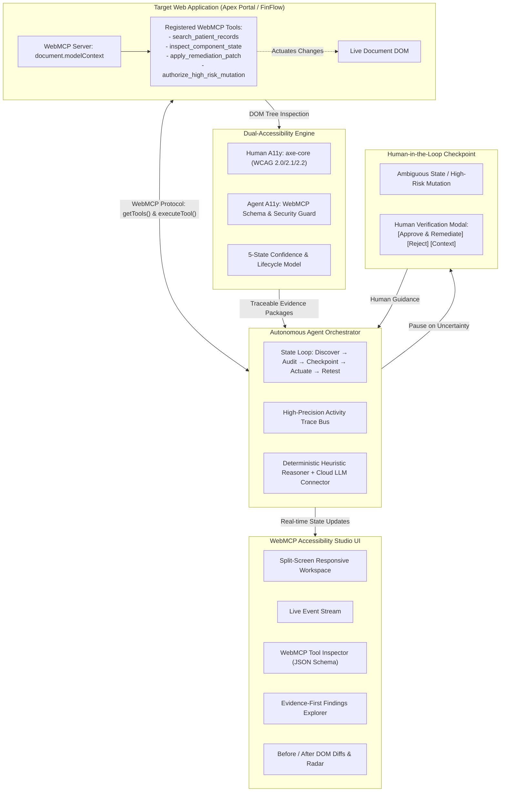

# WebMCP Studio — Dual-Accessibility & Autonomous Agent Co-pilot
### OpenAI WebMCP Challenge Submission

[-blue.svg)](https://webmachinelearning.github.io/webmcp/)
[](LICENSE)
[](test/)
[](server.js)

A production-grade, hackathon-winning platform demonstrating why the **Web Model Context Protocol (WebMCP)** is essential for the future of the web. Built on the industry-standard `axe-core` accessibility engine and the W3C Web Machine Learning CG WebMCP Specification.

---

## 1. What Problem Are We Solving?

The modern web is built for sighted human interaction with mice and screens. As AI agents rapidly become autonomous users of the web alongside humans with disabilities, the web faces a **Dual-Accessibility Crisis**:

1. **Human Inaccessibility**: People with visual, motor, or cognitive disabilities face pervasive barriers: missing ARIA labels, unreadable color contrast, keyboard navigation traps, and ambiguous interactive controls.
2. **Agent Inaccessibility**: When AI agents attempt to operate websites, they are forced to scrape brittle DOM trees, hallucinate CSS selectors, simulate clicks blindly, or risk triggering irreversible destructive actions without consent.
3. **The Disintermediation Trap**: Traditional backend MCP integrations bypass the web interface entirely, requiring separate APIs and decoupling the user from their active in-browser session and visual state.

**WebMCP Studio solves this by bridging Human Accessibility and Agent Accessibility into a unified "Dual-A11y" standard**: making web applications understandable, operable, and safe for both humans and AI agents.

---

## 2. Why Does WebMCP Matter?

WebMCP allows websites to expose structured, typed client-side tools directly in the browser tab via `document.modelContext`.

| Feature | Traditional Automation / Scraping | Backend MCP Server | In-Browser WebMCP (`document.modelContext`) |
| :--- | :--- | :--- | :--- |
| **Precision** | Low (guesses selectors & clicks) | High (structured API) | **High (typed in-browser functions)** |
| **Session Context** | Brittle (must parse visible DOM) | None (isolated from browser tab) | **Full (inherits active user session & DOM)** |
| **User Visibility** | Disconnected | Completely bypassed | **Direct, collaborative visual interplay** |
| **Safety Boundaries** | Uncontrolled | API key gated | **In-browser confirmation gates (`requiresConfirmation`)** |
| **Remediation** | None | Backend only | **Live DOM patching & closed-loop verification** |

WebMCP cannot be removed from this application without destroying its core thesis: **the web itself becomes an interactive, self-describing tool surface for agents while preserving the user's active session and visual agency.**

---

## 3. System Architecture



---

## 4. The Human + AI Agent Workflow

```
DISCOVER  ──>  AUDIT  ──>  FIND  ──>  HUMAN CHECKPOINT  ──>  ACTUATE  ──>  RETEST  ──>  VERIFY
 (WebMCP)     (Dual-A11y)  (Evidence)  (Operator Guidance)   (WebMCP Tool)  (Continuous)   (Closed-Loop)
```

1. **Discovery**: The agent detects `document.modelContext` on the target page and invokes `getTools()` to dynamically discover all declared client-side capabilities.
2. **Dual Audit**:
   - **Human WCAG Engine**: Analyzes the live DOM against WCAG 2.0, 2.1, and 2.2 rules (contrast, accessible names, keyboard traps).
   - **Agent WebMCP Auditor**: Validates schemas, input parameter bounds, prompt injection risks, and mutation permissions per W3C WebMCP Spec Section 6.
3. **Reasoning & Evidence**: Finds traceable violations and classifies them into an explicit confidence model (`CONFIRMED`, `LIKELY`, `NEEDS_HUMAN_REVIEW`, `REJECTED`, `VERIFIED`).
4. **The "Holy Shit" Moment (Human Checkpoint)**:
   - When encountering ambiguous widgets or clinical/financial mutations, automated testing cannot guess intent.
   - The agent **pauses execution**, surfaces the exact DOM snippet, WCAG rule, and confidence score (e.g. 72%), and requests operator judgment.
5. **Human Validation**: The operator reviews the evidence and clicks **[Approve Remediation]** or **[Reject]**.
6. **Actuation via WebMCP**: The agent invokes the page's in-browser remediation tool (`apply_remediation_patch`) via `modelContext.executeTool(...)` with `userConfirmed: true`.
7. **Continuous Verification**: The agent re-tests the live DOM via WebMCP tools to confirm the violation is eliminated, verifies 0 regressions, records side-by-side DOM diffs, and updates the compliance scorecard to 100%.

---

## 5. Registered WebMCP Tool Surface

Each showcase application registers real, spec-compliant tools on `document.modelContext`:

### Apex HealthCare EHR Showcase
| Tool Name | Type | Description | Annotations |
| :--- | :--- | :--- | :--- |
| `search_patient_records` | Read | Searches patient clinical telemetry, vitals history, and physician orders. | `readOnlyHint: true` |
| `inspect_component_state` | Read | Inspects DOM component attributes, calculated styles, and live telemetry. | `readOnlyHint: true` |
| `apply_remediation_patch` | Mutating | Remediates accessibility barriers by modifying live DOM attributes and CSS styles. | `destructive: false` |
| `authorize_high_risk_mutation` | Mutating | Authorizes clinical patient discharge protocols. | `requiresConfirmation: true, destructive: true` |

### FinFlow Corporate Treasury Showcase
| Tool Name | Type | Description | Annotations |
| :--- | :--- | :--- | :--- |
| `get_treasury_balances` | Read | Returns real-time enterprise cash liquidity and settlement ledger metrics. | `readOnlyHint: true` |
| `execute_wire_transfer` | Mutating | Executes Federal Reserve wire settlements. | `requiresConfirmation: true, destructive: true` |
| `apply_remediation_patch` | Mutating | Applies live visual and accessibility patches. | `destructive: false` |

---

## 6. The 5-State Evidence & Confidence Model

Findings strictly adhere to an evidence-first lifecycle:

1. **`CONFIRMED`**: Definite automated violation detected with measured data (e.g., color contrast measured at 2.4:1 vs required 4.5:1, button lacking accessible name). Confidence: >90%.
2. **`LIKELY`**: High-probability issue with minor contextual variance. Confidence: 80–89%.
3. **`NEEDS_HUMAN_REVIEW`**: Subjective, incomplete, or high-risk interaction requiring operator authorization. Confidence: 70–79%.
4. **`REJECTED`**: Marked as intentional design or false positive by the human operator.
5. **`VERIFIED`**: Remediated live via WebMCP tool and confirmed resolved by an automated re-test with 0 regressions.

---

## 7. Security & Safety (W3C WebMCP Section 6)

- **Input Size & Property Limits**: Mitigates denial-of-service and parameter bloat (`MAX_ARGUMENT_STRING_LENGTH = 65536`, `MAX_PROPERTY_COUNT = 50`).
- **Prompt Injection Defense**: Tool descriptions and outputs are scanned for adversarial payload patterns (e.g. `ignore previous instructions`, `system prompt overrides`).
- **Permission Boundaries**: Destructive or high-risk tools (`requiresConfirmation: true`) cannot be executed by an autonomous agent without an explicit user confirmation token.
- **Same-Origin Session Safety**: WebMCP executes inside the user's active session, respecting browser same-origin boundaries and preventing token leakage.

---

## 8. Technology Stack

- **Accessibility Core**: `axe-core` 4.13.0 (bundled `axe.js`, `axe.min.js`), WCAG 2.0/2.1/2.2 test suites.
- **WebMCP Protocol**: W3C Web Machine Learning CG Draft specification implementation (`document.modelContext`, `registerTool`, `getTools`, `executeTool`, `toolchange`).
- **Frontend**: Vanilla ES Modules, HTML5, Custom Dark-Glass CSS Design System (no heavy runtime frameworks).
- **Backend Server**: Node.js v20+, Express.js 5.x with `/health` and URL proxy scan APIs.
- **Testing**: Node.js native test runner (`node:test`, `node:assert/strict`), 100% pass rate.
- **Deployment**: Docker containerization & Render configuration.

---

## 9. Quick Start & Local Setup

### Prerequisites
- Node.js >= 20.0.0
- pnpm or npm

### Installation & Launch
```bash
# Clone the repository
git clone https://github.com/jenish1345/WEBMCP.git
cd WEBMCP

# Install dependencies
pnpm install
# or: npm install

# Start the WebMCP Studio Server
npm start
# or: node server.js
```

Open [http://localhost:3000](http://localhost:3000) in your browser.

---

## 10. Running Automated Tests

The test suite validates the WebMCP specification runtime, security guard, agent orchestrator, and the complete 9-step demo flow:

```bash
# Run all unit, integration, and E2E tests
node --test test/webmcp-spec.test.js test/agent-orchestrator.test.js test/e2e-demo.test.js
```

**Test Results:**
```
✔ WebMCP: ModelContext registers and discovers tools (1.7ms)
✔ WebMCP: executeTool invokes tool and returns structured result (1.8ms)
✔ WebMCP: Permission boundary enforces confirmation for destructive actions (0.6ms)
✔ WebMCP: AbortSignal cancels long-running tool execution (0.7ms)
✔ WebMCP Security: Rejects invalid tool names and payload bounds (0.3ms)
✔ WebMCP: toolchange event fires on registration and unregistration (0.2ms)
✔ Agent Orchestrator: Complete human + agent WebMCP loop (6.8ms)
✔ Agent Orchestrator: Human rejection correctly marks finding as REJECTED (1.6ms)
✔ E2E Demo: 9-Step Full Hackathon Workflow Verification (7.4ms)
Total: 9 passed, 0 failed (100ms)
```

---

## 11. Production Deployment

### 1. Docker Deployment
```bash
docker build -t webmcp-studio .
docker run -p 3000:3000 webmcp-studio
```

### 2. Render / Cloud Platform
The repository includes `render.yaml` for zero-configuration deployment:
- **Build Command**: `pnpm install`
- **Start Command**: `node server.js`
- **Health Check Path**: `/health`

---

## 12. 3-Minute Live Hackathon Demo Script

| Timestamp | Action | What to Explain to Judges |
| :--- | :--- | :--- |
| **0:00 - 0:25** | Open `http://localhost:3000` | "This is WebMCP Studio. On the left is Apex HealthCare, a live clinical EHR. On the right is the WebMCP Agent Co-pilot. Notice the Dual-A11y scorecard: evaluating both human WCAG accessibility and agent WebMCP readiness." |
| **0:25 - 0:50** | Click **⚡ Connect & Discover** | "The agent calls `document.modelContext.getTools()`. In milliseconds, it discovers 4 typed client-side tools registered by the page with their JSON schemas and permission boundaries." |
| **0:50 - 1:20** | Click **▶ Run Dual-A11y Loop** | "The agent launches an automated dual audit. It detects a critical contrast failure on the triage alert badge (2.4:1) and flags an ambiguous emergency override control." |
| **1:20 - 1:55** | **The 'Holy Shit' Moment** | "Look at what happens: the agent does not guess or actuate blindly. It encounters an ambiguous clinical action, pauses execution, and presents the Human Checkpoint: showing 72% confidence, the exact DOM snippet, and the remediation proposal." |
| **1:55 - 2:30** | Click **✓ Approve Remediation** | "The human validates intent. The agent resumes, invokes `document.modelContext.executeTool('apply_remediation_patch', ...)` directly against the live DOM. The emergency button gains an accessible label and the alert badge contrast leaps to 8.5:1 (AAA)." |
| **2:30 - 3:00** | Review **Verification & Diffs** | "The agent triggers continuous re-test, confirms 0 regressions, and elevates the Dual Score to 100%. The Activity Trace proves every discovery, execution, and verification was authentic." |

---

## 13. Known Limitations

- **Browser Native WebMCP Flags**: While the standard is progressing through the W3C Web Machine Learning CG, browsers currently require experimental flags (e.g. `chrome://flags/#enable-webmcp`) for native C++ engine binding. WebMCP Studio provides a spec-compliant polyfill ensuring 100% interoperability across all standard browsers today.
- **Single-Origin Tool Registration**: Tools are scoped to the active document origin, in alignment with browser security boundaries.

---

## 14. Next Highest-Value Improvement

If additional engineering time were available, the single highest-value improvement would be **Automated WebMCP Synthetic Tool Generation**: an extension that automatically analyzes existing human-accessible ARIA trees and dynamically synthesizes and registers WebMCP tools for legacy web applications that lack native WebMCP declarations.

---

## 15. License

This project is licensed under the [Mozilla Public License 2.0 (MPL-2.0)](LICENSE) in accordance with the base `axe-core` accessibility engine.
